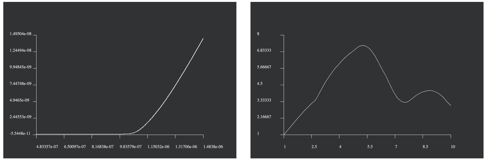
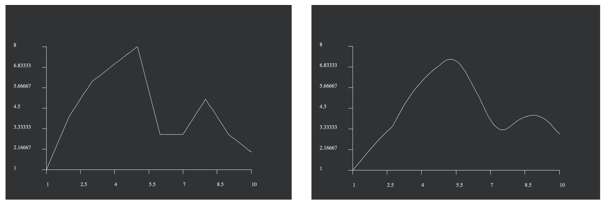
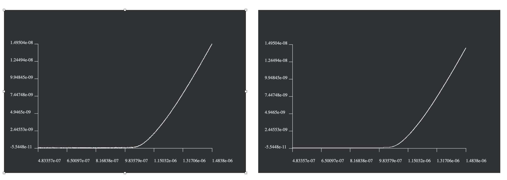

# Nanoplot, A simple line plot program.
 The goal of this project to generate a two-dimensional graph plot. The program can handle data with formating error and detect the right encoding. 
 This is a homework project by Jean Marc Bejjani for an interview with Nanosurf.
 


## Overview
- [Code Structure](#Code-Structure)
- [Requirements](#Requirements)
- [Tutorial](#tutorial)
- [Data Format](#data-format)
- [Results](#Results)

## Code Structure
The code is structured as follow:

```
src/
    DataLoader - manages the loading of the right Data Format. (Model)
    ProcessData - takes the loaded data from the loader and processes it so it can be displayed by the plotter. (Controller)
    Nanoplot - is responsible for displaying the visuals. (View)
    
 
data/
    original/ - contains the original data file to plot.
    tests/ - contains various data files to test the corner cases and robustness of the program.

```

It follows a Model-View-Controller (MVC) design pattern.

## Requirements

The code was tested on MACOS 10.15.3 and is built using cmake 3.11.1.

To install all the requirements follow the following step:

Install qt5
```
brew install qt5
```
Find the version installed (mine is 5.14.1)
```
ls /usr/local/Cellar/qt
```
Export the path to be found by cmake
```
export CMAKE_PREFIX_PATH=/usr/local/Cellar/qt/<version>
```
## Tutorial

To compile, build and execute the program:

Go to the build folder
```
cd build
```
Run cmake
```
cmake ../src/ -DCMAKE_INSTALL_PREFIX=../
make
make install
```
Run the executable
```
../bin/nanoplot
``` 

To run a test you can feed the test path as an argument. 
Example:

```
../bin/nanoplot ../data/tests/force_curve_nan.csv
```

Multiple visual and processing parameters can be easily modified in the src/constant.h file.
```
plot dimensions in pixels
shifts from the window's border in pixel
number of division per axis
size of the division line in pixel
number of data point under which we apply an interpolation
size of the moving average buffer (level of smoothing)
```

The available tests are
```
Empty file - returns empty data
Data with 1 columns - returns empty data
Data with 3 columns - returns empty data
Data with Nan values - skips the Nan data points and loads the others
Data not ASCII encoding - exit error
Straight line Data (same Y value) - changes the range in order to avoid Nan
unordered index Data - plots them normally (no reorder but could be implemented)
random plot with 10 Data points - to test the smoothing
```

## Data Format

The program can handle a specific data format:

It has to be CSV file with ';' or ',' as separators.
It has to be ASCII encoded.
It must contain 2 columns.

## Results

Here are some examples of plots done with the program:


